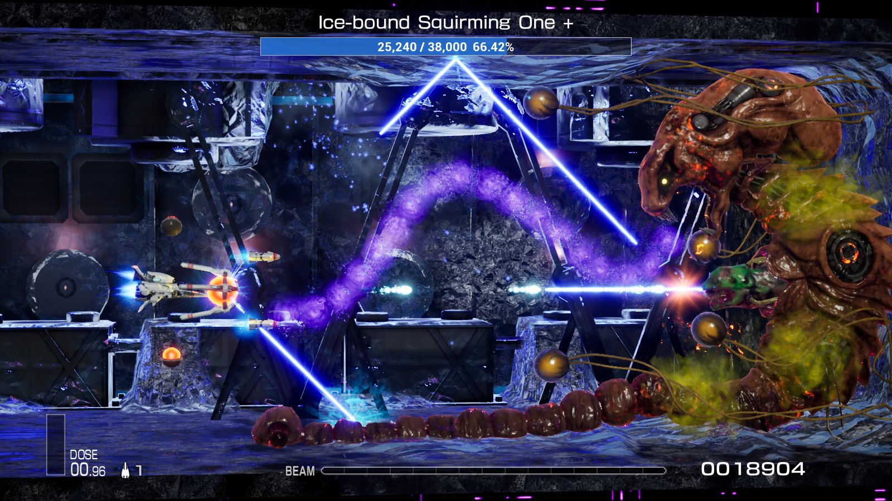
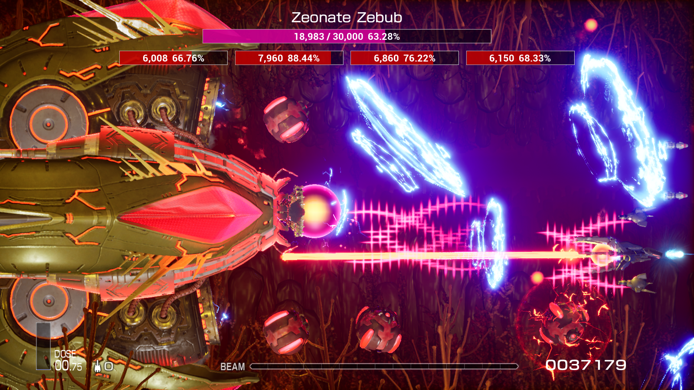
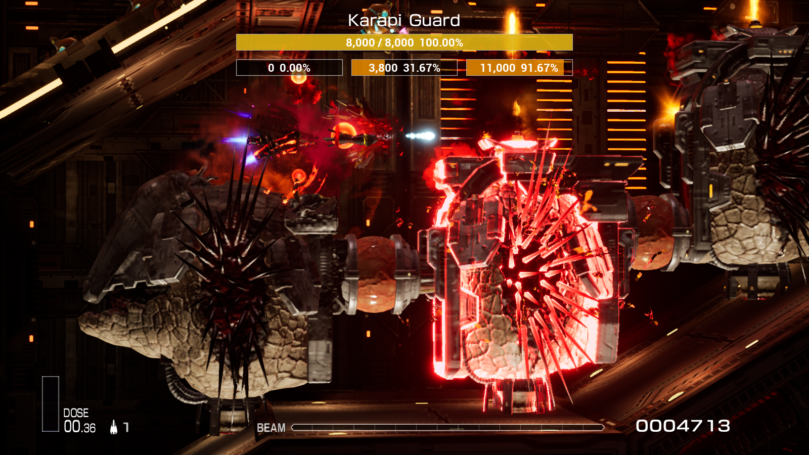

[简体中文](Readme/README.zhs.md) | [日本語](Readme/README.ja.md)

# Simple Boss LifeBar Mod for R-Type Final 2

## Features
- Supports displaying health for bosses with multiple cores and components.
- Displays health for some mini-bosses.
- Supports multiple languages.

## Known Issues
1. The mod does not support displaying dynamic health for the boss in Stage Z4.0. Currently, only the initial health is shown and does not decrease with damage.
2. The mod does not support displaying health for bosses in unreleased stages or custom stages.
3. It may not function correctly if scroll speed is modified using special methods.

## Installation Guide
1. If you haven't installed *UE4SS* yet, please follow the instructions in the [UE4SS Installation Guide](https://github.com/BLACKujira/RTF2ModdingGuide/blob/master/Chapter1_TheBasics/en/InstallingUE4SS.md) to install *UE4SS v3.0.0* and upgrade to *v3.0.1*.
2. Follow the instructions in [Installing Blueprint Mods](https://github.com/BLACKujira/RTF2ModdingGuide/blob/master/Chapter1_TheBasics/en/InstallingBlueprintMods.md) to install this mod.
3. If the installation is successful, after running the game, you should see the following output in the UE4SS console:
```
[xx:xx:xx] [Lua] [SimpleBossLifeBar] ModActorPath: /Game/Level/title/title.title:PersistentLevel.ModActor_C_2147482405
[xx:xx:xx] [Lua] [SimpleBossLifeBar] WE ARE NOW RUSHING INTO STAGE 0 BE ON YOUR GUARD!
```

## Important Notes
- Do not rename `SimpleBossLifeBar.pak`. UE4SS relies on the file name to locate the mod's entry point. Renaming it will prevent the mod from functioning properly.
- Older versions of *UE4SS* or other *Blueprint Mod Loaders* may also run this mod.

## Screenshots
  
  
  

## Final Notes
- If you want to contribute to the development of this project, please use `Unreal Engine 4.26.2` with a C++ compiler to open the project file.
- Pressing the mod button `SpawnBGMChangeListener` will generate an Actor that detects in-game BGM changes. When the BGM changes, it outputs the current BGM name, the ID and position of the scroll where the change occurred, and other information. This is used to record the location where the boss appears.
- I have spent a long time searching for the object that records the health of the Stage Z4.0 boss, but I have yet to find it. If you succeed in locating it, please add an issue or contact me through other means. Thank you!
