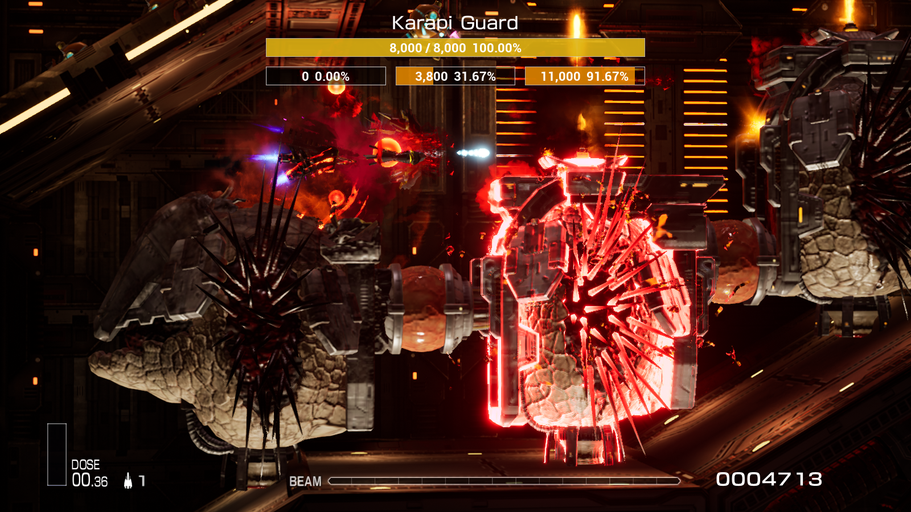

# R-Type Final 2 用の簡易BOSSライフバーMod

## 特徴
- 複数のコアや部位を持つBOSSの体力表示に対応
- 一部の小型BOSSの体力表示に対応
- 多言語対応

## 既知の問題
1. ステージZ4.0のBOSSの体力表示には対応していません。現在は初期体力のみが表示され、ダメージを受けても減少しません。
2. 未公開ステージやカスタムステージのBOSS体力表示には対応していません。
3. 特殊な手段でスクロール速度を変更した場合、正常に動作する保証はありません。

## インストール手順
1. [UE4SS-RE/RE-UE4SS](https://github.com/UE4SS-RE/RE-UE4SS) のチュートリアルに従ってUE4SS v3.0.0をインストールし、v3.0.1にアップグレードします。
2. 一度ゲームを起動し、ゲームディレクトリに `RTypeFinal2\Content\Paks\LogicMods` フォルダを作成させます。
3. Releasesから `SimpleBossLifeBar.pak` をダウンロードします。
4. `SimpleBossLifeBar.pak` を `RTypeFinal2\Content\Paks\LogicMods` フォルダにコピーします。
5. `RTypeFinal2\Content\Paks\pakchunk0-WindowsNoEditor.sig` を `RTypeFinal2\Content\Paks\LogicMods` フォルダにコピーし、`SimpleBossLifeBar.sig` に名前を変更します。

## 注意点
- `SimpleBossLifeBar.pak` の名前を変更しないでください。UE4SSはファイル名を利用してModのエントリを検出するため、名前を変更するとModが正常に動作しなくなります。
- `.sig` ファイルの名前は `.pak` ファイルと一致する必要があります。つまり `SimpleBossLifeBar.sig` にする必要があります。ゲームは実行時に `.pak` ファイルに対応する `.sig` 署名ファイルを確認します。理論上、ゲームの他の `.sig` ファイルも使用可能です。

## スクリーンショット
  
  
  

## 最後に
私は長い間試しましたが、ステージZ4.0のBOSS体力を記録するオブジェクトを見つけることができませんでした。もし見つけた場合は、issueを作成するか、その他の方法でご連絡ください。よろしくお願いします。