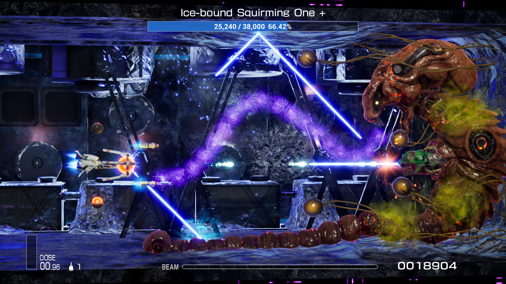

# 为R-Type Final 2设计的简易BOSS血条模组

## 特点
- 支持多个核心、多个部件的BOSS血量显示
- 支持一些小BOSS的血量显示
- 支持多种语言

## 已知问题
1. 暂不支持关卡Z4.0 BOSS的血量显示，目前只能显示初始血量，不会随受到伤害而下降
2. 暂不支持未发布关卡和自定义关卡的BOSS血量显示
3. 使用特殊手段改变卷轴速度时，不能保证正常运行

## 安装教程
1. 按照 [UE4SS-RE/RE-UE4SS](https://github.com/UE4SS-RE/RE-UE4SS) 及其文档中的教程安装UE4SS v3.0.0，并升级到v3.0.1
2. 运行一次游戏，如果安装成功，UE4SS的调试窗口会伴随游戏启动。此时游戏目录中会出现 `RTypeFinal2\Content\Paks\LogicMods` 文件夹
3. 下载 Releases 中的 `SimpleBossLifeBar.pak`。
4. 将 `SimpleBossLifeBar.pak` 复制到 `RTypeFinal2\Content\Paks\LogicMods` 中
5. 将 `RTypeFinal2\Content\Paks\pakchunk0-WindowsNoEditor.sig` **复制**到 `RTypeFinal2\Content\Paks\LogicMods` 中，并重命名为 `SimpleBossLifeBar.sig`
6. 如果安装成功，在UE4SS的控制台中可以看到这样的输出：
`[xx:xx:xx] [Lua] [SimpleBossLifeBar] ModActorPath: /Game/Level/title/title.title:PersistentLevel.ModActor_C_2147482405`
`[xx:xx:xx] [Lua] [SimpleBossLifeBar] WE ARE NOW RUSHING INTO STAGE 0 BE ON YOUR GUARD!`

## 注意点
- 不要重命名 `SimpleBossLifeBar.pak` ，UE4SS依赖文件名寻找MOD的入口，如果重命名会导致MOD无法正常运作
- .sig的名字需要与.pak文件一致，即 `SimpleBossLifeBar.sig` 。游戏在运行时会检查.pak文件是否有对应的.sig签名文件，理论上游戏的其他.sig文件也可以使用
- 如果UE4SS的调试窗口为一片空白，请将 `RTypeFinal2\Binaries\Win64\UE4SS-settings.ini` 中 `GraphicsAPI` 的值改为 `dx11`

## 图片
  
  
  

## 最后
此项目使用 `Unreal Engine 4.26.2` 开发，需要C++编译器的支持
点击MOD按钮 `SpawnBGMChangeListener` 会生成一个检测游戏内BGM变化的Actor，在BGM变化时输出当前的BGM名、发生变化时卷轴的ID、位置等信息。用于记录BOSS出现的位置
我尝试了很久，但始终无法找到记录关卡Z4.0 BOSS血量的对象。如果你成功找到了，请添加issues或者用其他方法联系我，谢谢。
