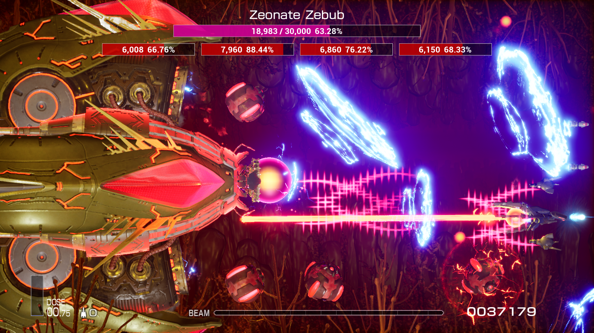

# 为R-Type Final 2设计的简易BOSS血条模组

## 特点
- 支持多个核心、多个部件的BOSS血量显示
- 支持一些小BOSS的血量显示
- 支持多种语言

## 已知问题
1. 暂不支持关卡Z4.0 BOSS的血量显示，目前只能显示初始血量，不会随受到伤害而下降
2. 暂不支持未发布关卡和自定义关卡的BOSS血量显示
3. 使用特殊手段改变卷轴速度时，不能保证正常运行

## 安装教程
1. 如果你还没有安装 *UE4SS* ，请按照 [安装UE4SS](https://github.com/BLACKujira/RTF2ModdingGuide/blob/master/Chapter1_TheBasics/zhs/%E5%AE%89%E8%A3%85UE4SS.md) 中的教程安装 *UE4SS v3.0.0* ，并升级到 *v3.0.1*
2. 下载 [Releases](https://github.com/BLACKujira/SimpleBossLifeBarMod/releases) 中的 `SimpleBossLifeBar.pak`
3. 按照 [安装蓝图Mod](https://github.com/BLACKujira/RTF2ModdingGuide/blob/master/Chapter1_TheBasics/zhs/%E5%AE%89%E8%A3%85%E8%93%9D%E5%9B%BEMod.md) 中的教程安装这个Mod
4. 如果安装成功，运行游戏后将在UE4SS的控制台中可以看到这样的输出：
```
[xx:xx:xx] [Lua] [SimpleBossLifeBar] ModActorPath: /Game/Level/title/title.title:PersistentLevel.ModActor_C_2147482405
[xx:xx:xx] [Lua] [SimpleBossLifeBar] WE ARE NOW RUSHING INTO STAGE 0 BE ON YOUR GUARD!
```

## 注意点
- 不要重命名 `SimpleBossLifeBar.pak` ，UE4SS依赖文件名寻找MOD的入口，如果重命名会导致MOD无法正常运作
- 更低版本的 *UE4SS* 或者其他的 *蓝图Mod加载器* 或许也能运行这个Mod。

## 图片
  
  
  

## 最后
- 如果要协助开发这个项目，请使用配备C++编译器的 `Unreal Engine 4.26.2` 打开项目文件。
- 点击MOD按钮 `SpawnBGMChangeListener` 会生成一个检测游戏内BGM变化的Actor，在BGM变化时输出当前的BGM名、发生变化时卷轴的ID、位置等信息。用于记录BOSS出现的位置
- 我尝试了很久，但始终无法找到记录关卡Z4.0 BOSS血量的对象。如果你成功找到了，请添加issues或者用其他方法联系我，谢谢。
